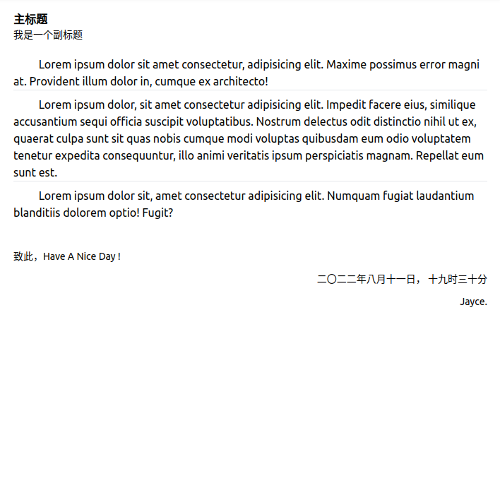
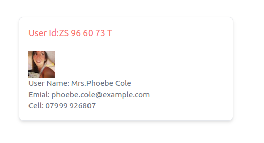
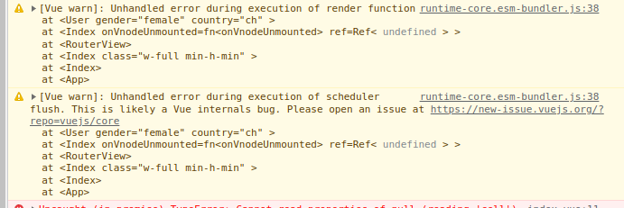

### 插槽分为 匿名插槽  和 具名插槽

匿名插槽就是不指定 `name` 属性， 具名插槽就是指定了 `name` 属性，  匿名插槽会有一个默认的 name 值， 即 "default"



**src/layout/Content/index.vue**

```vue
<script setup lang="ts">
import ArticleHeaderVue from '@/components/Article/ArticleHeader.vue';
import ArticleMainVue from '@/components/Article/ArticleMain.vue';
import ArticleFooterVue from '@/components/Article/ArticleFooter.vue';
</script>

<template>
  <div class="p-5">
    <div class="article">
      <ArticleHeaderVue>
        <template v-slot:title>主标题</template>
        <template v-slot:subtitle>我是一个副标题</template>
      </ArticleHeaderVue>
      <ArticleMainVue>
        <template v-slot:main-intro>
          Lorem ipsum dolor sit amet consectetur, adipisicing elit. Maxime possimus error magni at. Provident illum
          dolor in, cumque ex architecto!
        </template>
        <template v-slot:main-body>
          Lorem ipsum dolor, sit amet consectetur adipisicing elit. Impedit facere eius, similique accusantium sequi
          officia suscipit voluptatibus. Nostrum delectus odit distinctio nihil ut ex, quaerat culpa sunt sit quas nobis
          cumque modi voluptas quibusdam eum odio voluptatem tenetur expedita consequuntur, illo animi veritatis ipsum
          perspiciatis magnam. Repellat eum sunt est.
        </template>
        <template v-slot:main-summary>
          Lorem ipsum dolor sit, amet consectetur adipisicing elit. Numquam fugiat laudantium blanditiis dolorem optio!
          Fugit?
        </template>
      </ArticleMainVue>
      <ArticleFooterVue>
        <template v-slot:footer-writersaying>致此，Have A Nice Day !</template>
        <template v-slot:footer-date>二〇二二年八月十一日， 十九时三十分</template>
        <template v-slot:footer-writersign>Jayce.</template>
      </ArticleFooterVue>
    </div>
  </div>
</template>
```

**src/components/Article/ArticleHeader.vue**

```vue
<template>
  <div>
    <h2 class="font-bold text-black-700">
      <slot name="title"></slot>
    </h2>
    <h3 class="text-sm text-black-700">
      <slot name="subtitle"></slot>
    </h3>
  </div>
</template>
```

**src/components/Article/ArticleMain.vue**

```vue
<template>
  <div class="mt-5">
    <!-- &emsp;是制表符 tab缩进 -->
    &emsp;&emsp;
    <slot name="main-intro"></slot>
  </div>
  <hr>
  <div class="mt-2">
    &emsp;&emsp;
    <slot name="main-body"></slot>
  </div>
  <hr>
  <div class="mt-2">
    &emsp;&emsp;
    <slot name="main-summary"></slot>
  </div>
</template>
```

**src/components/Article/ArticleFooter.vue**

```vue
<template>
  <div class="mt-10 text-sm">
    <div>
      <slot name="footer-writersaying"></slot>
    </div>
    <div class="mt-3 text-end">
      <slot name="footer-date"></slot>
    </div>
    <div class="mt-3 text-end">
      <slot name="footer-writersign"></slot>
    </div>
  </div>
</template>
```


以上实例中， `v-slot` 可以被缩写为 `#`, 修改以上的实例，看起来就像这样：

**src/layout/Content/index.vue**

```vue
<script setup lang="ts">
import ArticleHeaderVue from '@/components/Article/ArticleHeader.vue';
import ArticleMainVue from '@/components/Article/ArticleMain.vue';
import ArticleFooterVue from '@/components/Article/ArticleFooter.vue';
</script>

<template>
  <div class="p-5">
    <div class="article">
      <ArticleHeaderVue>
        <template #title>标题</template>
        <template #subtitle>我是一个副标题</template>
      </ArticleHeaderVue>
      <ArticleMainVue>
        <template #main-intro>
          Lorem ipsum dolor sit amet consectetur, adipisicing elit. Maxime possimus error magni at. Provident illum
          dolor in, cumque ex architecto!
        </template>
        <template #main-body>
          Lorem ipsum dolor, sit amet consectetur adipisicing elit. Impedit facere eius, similique accusantium sequi
          officia suscipit voluptatibus. Nostrum delectus odit distinctio nihil ut ex, quaerat culpa sunt sit quas nobis
          cumque modi voluptas quibusdam eum odio voluptatem tenetur expedita consequuntur, illo animi veritatis ipsum
          perspiciatis magnam. Repellat eum sunt est.
        </template>
        <template #main-summary>
          Lorem ipsum dolor sit, amet consectetur adipisicing elit. Numquam fugiat laudantium blanditiis dolorem optio!
          Fugit?
        </template>
      </ArticleMainVue>
      <ArticleFooterVue>
        <template #footer-writersaying>致此，Have A Nice Day !</template>
        <template #footer-date>二〇二二年八月十一日， 十九时三十分</template>
        <template #footer-writersign>Jayce.</template>
      </ArticleFooterVue>
    </div>
  </div>
</template>
```


### 插槽作用域

插槽作用域在 匿名插槽 和 具名插槽 的使用上存在差异，

以下是一个实例， 

传入 User 组件查询条件， 然后渲染出对应的用户卡片：

**src/views/SlotScope/index.vue**

```vue
<script setup lang="ts">
import User from './User.vue'; 
</script>
<template>

  <User gender="female" country="ch">
      <template #default="slotProps">User Id:{{slotProps.id}}</template>
      <!-- <template v-slot:default="slotProps">User Id:{{slotProps.id}}</template> -->
      <template #userinfo="{user:{cell,email,picture:{thumbnail},name:{title,first,last}}}">
        <!-- <template v-slot:userinfo="{user:{cell,email,picture:{thumbnail},name:{title,first,last}}}"> -->
        
        <p>User Name: {{title+'.'+ first+' '+ last}}</p>
        <p>Emial: {{email}}</p>
        <p>Cell: {{cell}}</p>
      </template>
  </User>  
</template>
```


**src/views/SlotScope/User.vue**

```vue
<script setup lang="ts">
import { onBeforeMount, ref } from 'vue'
let userinfo: any = ref(null)
let userId = ref('')
const props = defineProps({
  gender: {
    default: 'male'
  },
  country: {
    default: 'us'
  }
})
const { gender, country } = props
onBeforeMount(() => {
  // https://randomuser.me/documentation#howto
  fetch(`https://randomuser.me/api/?gender=${gender}?nat=${country}`).then(res => {
    res.json().then(parse => {
      userinfo.value = parse.results[0]
      userId.value = parse.results[0].id.value
    })
  })
})
</script>
<template>
  <div class="w-96 border shadow-md rounded-lg m-10 p-4">
    <div class="text-red-400">
      <slot :id="userId"></slot>
    </div>
    <div class="mt-5 text-sm text-gray-500">
      <slot name="userinfo" :user="userinfo"></slot>
    </div>
  </div>
</template>
```



> TODO: 这个例子中点问题， 写了两个卡片，只会渲染一个
>
> 
