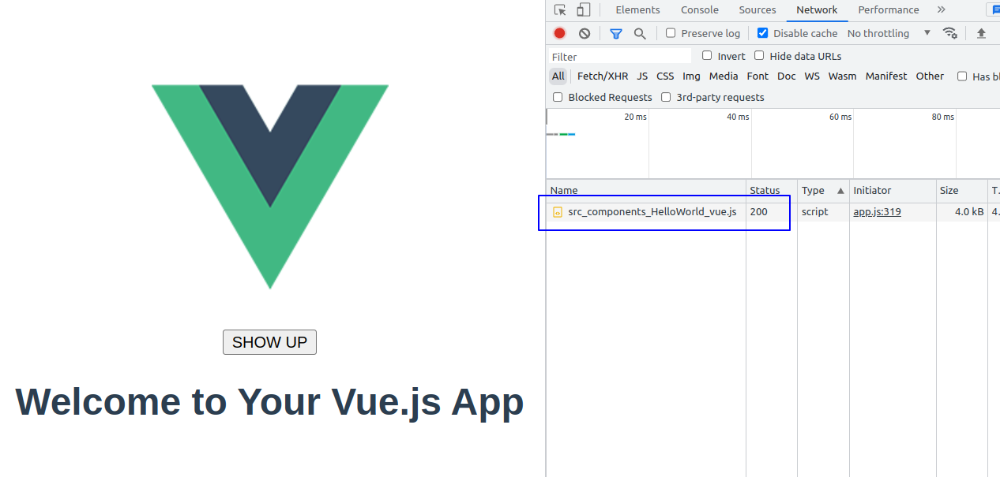
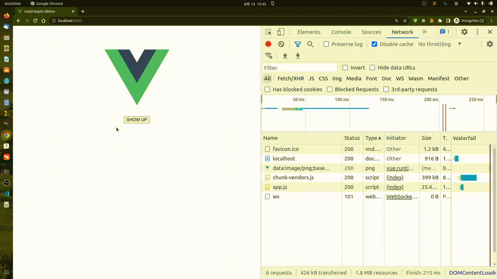

[toc]

### 1. 什么是异步组件？

异步组件，指的是 在需要的时候，再去从服务器加载该组件代码。

例如：

异步组件有这样一个特点： 某个条件渲染为 `false` 的异步子组件，当页面首次加载其父组件时， 该子组件的模块代码并不会被下载， 因为 打包器在解析异步组件的时候，会将其进行单独打包。 当修改其渲染条件为 `true` 时， 浏览器才开始去从服务器下载对应的 模块代码。 

**异步组件有什么样的应用场景呢？**

通常，如果一个组件比较庞大，又有一定的触发渲染机制的时候，我们可以利用 异步组件 去使得当前页面加载更快。 例如，对于一个有很多模块的页面，如果视图需要滚动才能看到某些模块，我们就可以通过把这些组件条件的异步加载，会使得我们的页面渲染更快。 

下图仅是一个实例图说明




### 2. 回顾 Vue2 中异步组件, 并进一步观察异步组件的特点

> [API doc](https://v2.cn.vuejs.org/v2/guide/components-dynamic-async.html#%E5%BC%82%E6%AD%A5%E7%BB%84%E4%BB%B6)

在 Vue

我们将使用 Vue2 提供给我们的 API ， 创建一个条件渲染的异步组件， 以观察 异步组件具体有什么特征。 

在 vue2 有这样几种办法去定义一个异步组件：

1. 通过工厂函数，返回一个 import Promise
2. 通过工厂函数，返回一个固定格式的对象;
3. 通过工厂函数，提供的 `resolve` 回调返回组件实例；

#### 2.1 通过工厂函数，返回一个import Promise

我们先讨论一种，最简单的使用，也就是 **通过工厂函数，返回一个import Promise**

```vue
<template>
  <div id="app">
    
    <p style="text-align: center">
      <button @click="show = true">SHOW UP</button>
    </p>
    <HelloWorld v-if="show" msg="Welcome to Your Vue.js App" />
  </div>
</template>

<script>
const AsyncComp = function () {
  return import('./components/HelloWorld.vue');
};

export default {
  name: 'App',
  components: {
    HelloWorld: AsyncComp,
  },
  data() {
    return {
      show: false,
    };
  },
};
</script>
```

可以进一步简写：

```js
components: {
    HelloWorld: ()=> import('./components/HelloWorld.vue'),
},
```

是不是和异步路由的一样的 ？



你会发现，页面首次加载， 这个 组件的模块对应的js 文件并没有被加载， 当点击 SHOW UP 按钮，才会去加载该组件代码，并渲染。

你还可以通过以下语法格式别名编译导出的包名：

```js
import(/* webpackChunkName:'HelloWord' */ './components/HelloWorld.vue'),
```


接着我们看看，第二种写法 **通过工厂函数，返回一个固定格式的对象;**

#### 2.2 通过工厂函数，返回一个固定格式的对象;

> 这个方式在实际应用中，出现了
> [Vue warn]: Failed to resolve async component: 
>
> 这样的报错， github issue 以及 搜索引擎 没找到明确解决办法，不建议使用， 需要使用时在去看看到底怎么回事。 

```vue
<template>
  <div id="app">
    
    <p style="text-align: center">
      <button @click="show = true">SHOW UP</button>
    </p>
    <HelloWorld v-if="show" msg="Welcome to Your Vue.js App" />
  </div>
</template>

<script>
import ErrorComponent from './components/ErrorComponent.vue';
import LoadingComponent from './components/LoadingComponent.vue';
const AsyncComp = function () {
  return {
    // 需要加载的组件 (应该是一个 `Promise` 对象)
    component: import('./components/HelloWorld.vue'),
    // 异步组件加载时使用的组件
    loading: LoadingComponent,
    // 加载失败时使用的组件
    error: ErrorComponent,
    // 展示加载时组件的延时时间。默认值是 200 (毫秒)
    delay: 200,
    // 如果提供了超时时间且组件加载也超时了，
    // 则使用加载失败时使用的组件。默认值是：`Infinity`
    timeout: 500,
  };
};

export default {
  name: 'App',
  components: {
    HelloWorld: AsyncComp,
  },
  data() {
    return {
      show: false,
    };
  },
};
</script>
```



上例中指定了 loading 和 error 组件， 除了这样去指定，你还可以提供一个 vue 组件实例对象。 

```vue
<template>
  <div id="app">
    
    <p style="text-align: center">
      <button @click="show = true">SHOW UP</button>
    </p>
    <HelloWorld v-if="show" msg="Welcome to Your Vue.js App" />
  </div>
</template>

<script>
const AsyncComp = () => ({
  // 需要加载的组件 (应该是一个 `Promise` 对象)
  component: import('./components/HelloWorld.vue'),
  // 异步组件加载时使用的组件
  loading: {
    template: '<div>loading... and {{ msg }}</div>',
    data: function () {
      return {
        msg: 'world peace!',
      };
    },
  },
  // 加载失败时使用的组件
  error: {
    template: '<div>error ! and {{ msg }}</div>',
    data: function () {
      return {
        msg: 'world peace!',
      };
    },
  },
  // 展示加载时组件的延时时间。默认值是 200 (毫秒)
  delay: 200,
  // 如果提供了超时时间且组件加载也超时了，
  // 则使用加载失败时使用的组件。默认值是：`Infinity`
  timeout: 500,
});

export default {
  name: 'App',
  components: {
    HelloWorld: AsyncComp,
  },
  data() {
    return {
      show: false,
    };
  },
};
</script>
```

#### 2.3 通过工厂函数，提供的 `resolve` 回调返回组件实例

这种方式有两个子级实现, 一种是：

##### 2.3.1 将异步组件和 webpack 的 code-splitting 功能一起配合使用: 

```js
Vue.component('async-webpack-example', function (resolve) {
  // 这个特殊的 `require` 语法将会告诉 webpack
  // 自动将你的构建代码切割成多个包，这些包
  // 会通过 Ajax 请求加载
  require(['./my-async-component'], resolve)
})
```

```vue
<template>
  <div id="app">
    
    <p style="text-align: center">
      <button @click="show = true">SHOW UP</button>
    </p>
    <HelloWorld v-if="show" msg="Welcome to Your Vue.js App" />
  </div>
</template>

<script>
const AsyncComp = function (resolve) {
  require(['./components/HelloWorld'], resolve);
};

export default {
  name: 'App',
  components: {
    HelloWorld: AsyncComp,
  },
  data() {
    return {
      show: false,
    };
  },
};
</script>

```

还可以

##### 2.3.2 直接给 `resolve`  传入一个 组件实例对象：

```vue
<template>
  <div id="app">
    
    <p style="text-align: center">
      <button @click="show = true">SHOW UP</button>
    </p>
    <HelloWorld v-if="show" msg="Welcome to Your Vue.js App" />
  </div>
</template>

<script>
const AsyncComp = function (resolve) {
  resolve({
    template: '<div>I am async! and {{ msg }}</div>',
    data: function () {
      return {
        msg: 'world peace!',
      };
    },
  });
};

export default {
  name: 'App',
  components: {
    HelloWorld: AsyncComp,
  },
  data() {
    return {
      show: false,
    };
  },
};
</script>
```

> 在使用这种方式是， 可能会遇到这样的报错：
> [Vue warn]: You are using the runtime-only build of Vue where the template compiler is not available. Either pre-compile the templates into render functions, or use the compiler-included build
>
> 需要新增一个 webpack 配置：
>
> ```js
> const { defineConfig } = require('@vue/cli-service')
> module.exports = defineConfig({
>   transpileDependencies: true,
>   runtimeCompiler: true,// 开启运行时编译
> })
> ```


### 3. Vue 3 中异步组件的基本语法

